

# 🌟 Respy.Tech 🌟

Respy.Tech is an interactive web platform featuring free AI API providers
 
(Shika Shika Shika)

## 🤝 API Providers

| Provider | Owner | Links | Notes |
|----------|-------|-------|-------|
|  Rimunace | 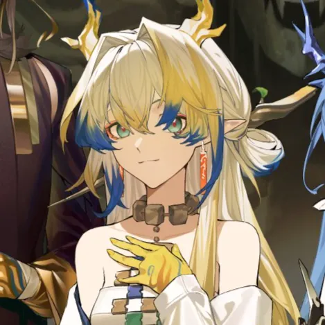 Respire  James | [Website](https://api.rimunace.xyz) • [Discord](https://discord.gg/respy-tech) • [GitHub](https://github.com/rimunace) | This API is maintained by me (Respire) and with the help of James"without dot". I kid you not, James a fun guy to talk with |
| 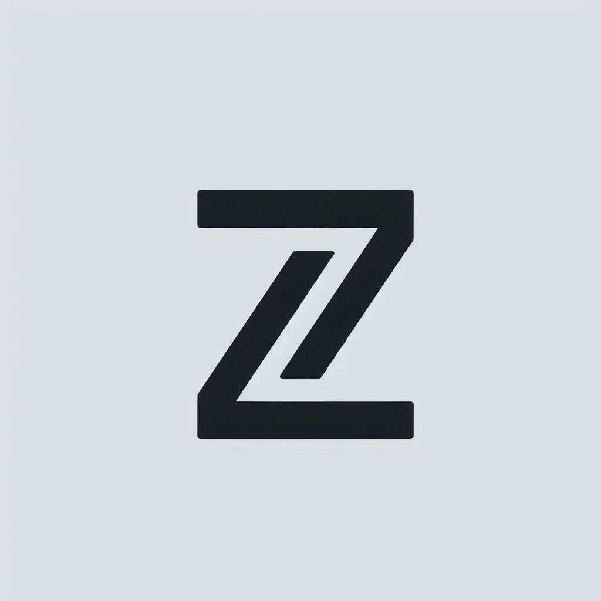 Zanity |  Voidi  Cookie | [Website](https://zanity.xyz/) • [Discord](https://discord.gg/4DRjqaFkhd) | This API is made by Voidi, zukijourney's dev and has a good API support & stability |
|  AnyAI |  meow_18838 | [Website](https://api.airforce/) • [Discord](https://discord.com/invite/q55gsH8z5F) • [GitHub](https://github.com/meow-18838) | This API doesn't require an API key for free tier user, a plug and play API |
| 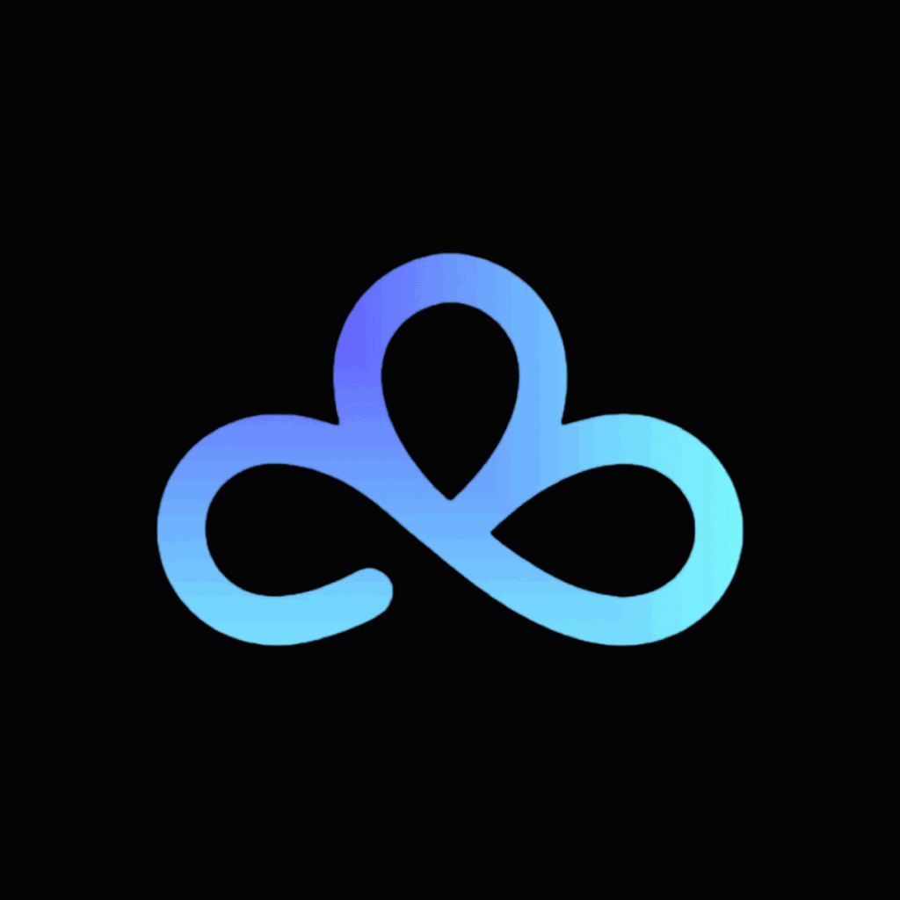 CablyAI |  meow_18838 | [Website](https://cablyai.com/) • [Discord](https://discord.gg/2k4j4PxE) • [GitHub](https://github.com/meow-18838) | This API requires 10 valid invites to be used or behind a 20$ paywall (negotiable) |
|  FresedGPT |  fresed | [Website](https://fresed-api.gitbook.io/fresed-api) • [Discord](https://discord.gg/QX86yU4G) • [GitHub](https://github.com/qazplmqaz) | This API is very recommended for everyone but (some) Claude model requires payment. Respected developer |
|  HeckerAI | 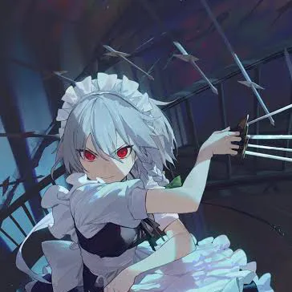 heckerai.com | [Website](https://heckerai.com) • [Discord](https://discord.gg/Hg7jw8K8) • [GitHub](https://github.com/LiveGamer101) | This API is made by a great mastermind, hecker. Claude access are gated behind monthly subscription |
|  Shard-AI | 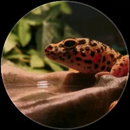 .puzzy. 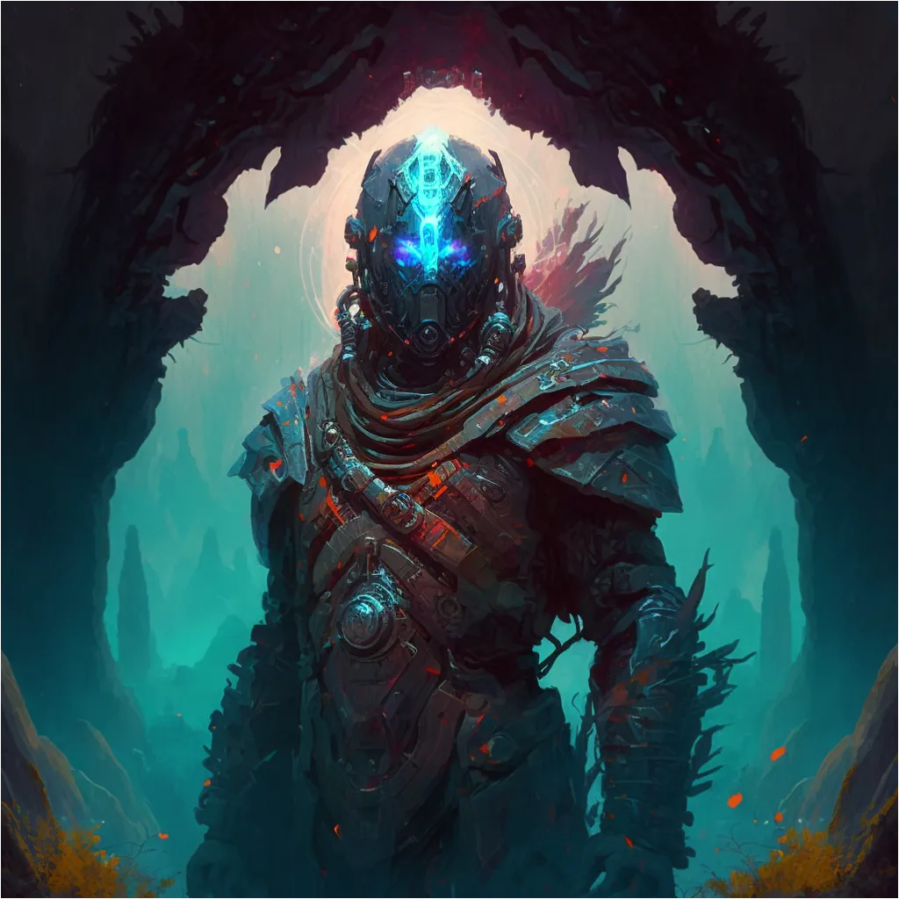 quartzwarrior | [Website](https://shard-ai.xyz) • [Discord](https://discord.shard-ai.xyz/) • [GitHub](https://github.com/Puzzy124) | This API is made by yet another great mastermind(s), puzzy and quartz. I know what you're thinking about shard-ai, but just accept it that their services are top-notch |
|  ZukiJourney |  ZukiJourney Team | [Website](https://zukijourney.xyz) • [Discord](https://discord.gg/zukijourney) • [GitHub](https://github.com/zukijourney) | This API is practically leading the API provider scene. Largest API provider with 6,000 members |
|  ShadowJourney |  ichatei | [Website](https://shadowjourney.xyz) • [Discord](https://discord.com/invite/yB2YZJUA3F) | This API is made by "The Honoured One" or just call him ichatei (Ichate). Will be sitting in a comfortable zone for API usage |
|  Shuttle AI |  xtristan | [Website](https://shuttleai.app) • [Discord](https://discord.com/invite/shuttleai) • [GitHub](https://github.com/tristandevs) | This API run with the basis of pay-as-you-go with a clean dashboard management and focus solely on own trained model. Claim 1$ credits for free every month |
| 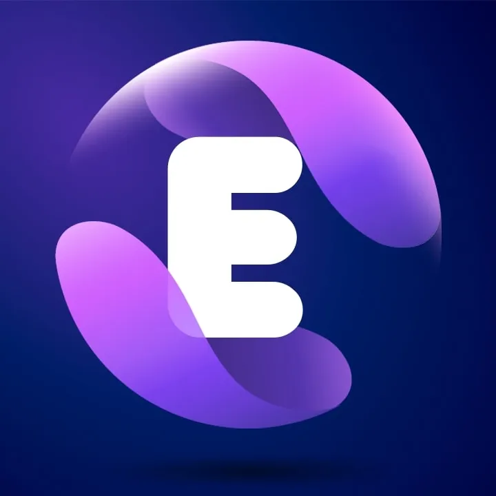 Electron Hub |  Soukyo  Kasu | [Website](https://api.electronhub.top) • [Discord](https://discord.gg/apUUqbxCBQ) • [GitHub](https://github.com/snowby666) | This API uses token based pricing and so far has gone further and beyond by releasing a Character Card feature for roleplayers. Recommended for those who want to RP and wanting a POE alternative |
|  Oxygen |  Tornadosoftware  Thesketchubuser | [Website](https://oxyapi.uk) • [Discord](https://discord.com/invite/kM6MaCqGKA) • [GitHub](https://github.com/tornado-softwares) | This API has changed to pay-as-you-go and updated their dashboard layout. Still a good service nonetheless |
| 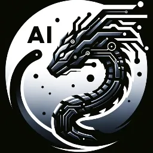 Naga AI |  Zentixua | [Website](https://naga.ac) • [Discord](https://discord.com/invite/JxRBXBhabu) • [GitHub](https://github.com/ZentixUA) | Based on https://cas.zukijourney.com, this API is a successor of ChimeraGPT, the largest API in history with 15k users |
|  Skailar |  Aquadraws | [Website](https://test.skailar.it/) • [Discord](https://discord.com/invite/ka9tkU9UNz) | This API was never used by me but regardless, this api itself is in a good shape |
|  HelixMind |  Faer1x | [Website](https://helixmind.online) • [Discord](https://discord.gg/n7RpEtH8J8) | This API is owner has a goal to provide Stable and Reliable service. Fastest API to add new models on-demand/on-request so far I have ever seen (this might be off by certain metrics) |
|  HareProxy |  yongdong | [Website](https://api.hareproxy.io.vn/) • [Discord](https://discord.com/invite/7TAXPFvUzf) • [GitHub](https://github.com/sm1945) | This API is pretty damn good with their stability and performance. Running on multiple endpoint for different corporate models. Recently released a unified endpoint |
|  g4f.pro |  Vneq | [Website](https://g4f.pro/) • [Discord](https://discord.gg/rQJMcHmS) • [GitHub](https://github.com/vneqisntreal) | This API was updated the most in this list. Name of server constantly changes and has changed to token-based crediting system. Announcement also stated for an addition of pay-as-you-go which is optional |
| 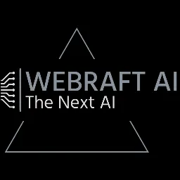 WebraftAI |  DS_GAMER | [Website](https://api3.webraft.in/) • [Discord](https://discord.com/invite/ncaagQjhQ8) • [GitHub](https://github.com/ds-gamer) | This API is made by DS_GAMER and made a return after a long recovery from illness. The API is once again in a great shape. The list here is fromt the v2 model list. Not much to update |
|  NoBrandAI |  harmon.tr | [Website](https://nobrandai.com) • [Discord](https://discord.com/invite/nobrandai) • [GitHub](https://github.com/harmon-tr) | This API is originally owned by GG, and has transfered ownership to harmon.tr. Sadly enough that their Claude model is Not-Available for now |
| 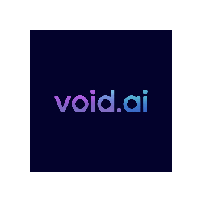 VoidAI | 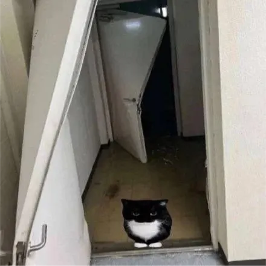 acatto | [Website](https://voidai.xyz) • [Discord](https://discord.gg/voidai) • [GitHub](https://github.com/acatto) | This API is made by acatto. Fairly new API so not much to comment about it. In owner's word, "stable, fast, and reliable API". May success comes through |

## 📄 License

This project is licensed under the MIT License. For details, see the [LICENSE](LICENSE) file.

## 📞 Contact

If you have any questions, need assistance, suggest a feature, or any other inquiries, you're welcome to contact me through the following channels:

- Email: [contact@respy.tech](mailto:contact@respy.tech)
- Discord: [Respy.Tech](https://discord.gg/respy-tech) (or my Discord: respire)
